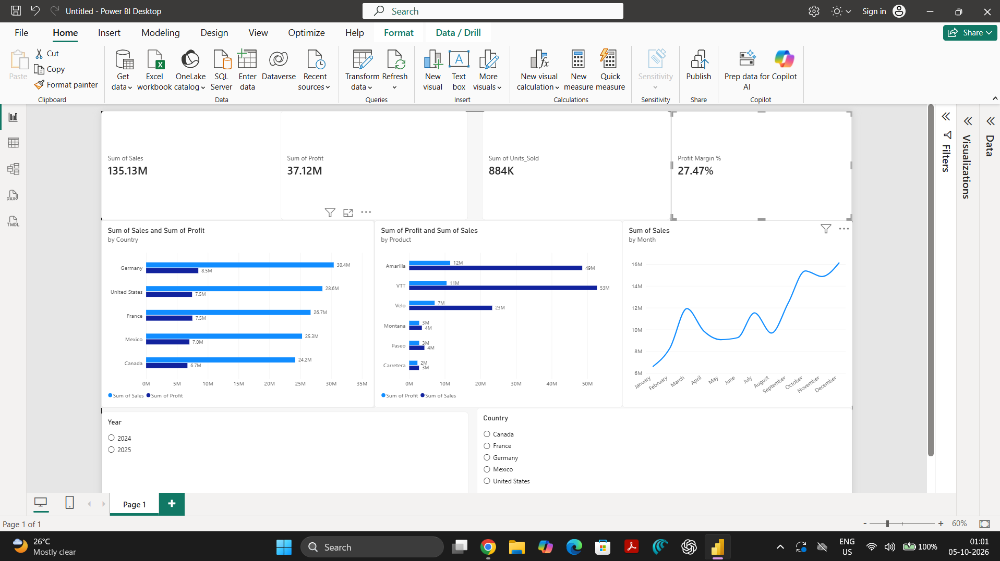

# Sales Performance Analysis

End-to-end sales analysis project using **Excel, MySQL, and Power BI** to evaluate revenue, profitability, product performance, country performance, discount behavior, customer segments, and monthly trends.



## Project Objective

The goal of this project is to answer practical business questions such as:

- Which countries generate the most sales and profit?
- Which products drive revenue, and which have weak margins?
- Which customer segments are most profitable?
- How do sales and profit change by month and year?
- Do higher discounts reduce profitability?
- Which areas deserve management attention?

## Tools Used

- **Excel** — initial data checks and validation
- **MySQL** — KPI calculation, grouping, trend analysis, and profitability analysis
- **Power BI** — interactive dashboard and slicers

## Workflow

`CSV → Excel validation → MySQL analysis → Power BI dashboard → Business insights`

## Dashboard KPIs

- Total Sales
- Total Profit
- Units Sold
- Profit Margin %

## Analysis Performed

### Country Performance
Compared total sales, total profit, profit margin, discount percentage, and COGS percentage by country.

### Product Performance
Compared product-level sales, profit, profit margin, COGS, and discounts to identify high-revenue but low-margin products.

### Segment Performance
Compared sales, profit, margin, and cost structure across customer segments.

### Time Trends
Analyzed monthly sales, monthly profit, and year-over-year performance to identify strong and weak periods.

### Discount Analysis
Compared sales, profit, and margin across discount bands to test whether heavier discounting improves business performance.

## Key Insights

- **Germany** generated the highest total sales and total profit.
- **France** had the strongest country-level profit margin, while the **United States** had the weakest margin among the countries analyzed.
- **VTT** was a strong sales driver but had the weakest product margin, largely because its COGS ratio was higher than stronger-margin products.
- **Enterprise** was the strongest segment by total profit and margin, while Small Business generated strong sales but carried a higher cost ratio.
- **December** was the strongest month for both sales and profit, while **January** was the weakest sales month.
- Profitability declined as discount intensity increased: the no-discount band had the strongest margin, followed by low, medium, and high discount bands.

## Business Recommendations

1. **Review the cost structure of VTT** because strong revenue is not translating into equally strong margins.
2. **Avoid unnecessary high discounting**; higher discount bands showed progressively weaker profitability.
3. **Study the economics of stronger-margin countries and segments** and replicate successful pricing or cost practices where possible.

## Repository Structure

```text
sales-performance-analysis/
├── README.md
├── data/
│   └── level_1_sales_dataset.csv
├── sql/
│   └── sales_analysis.sql
├── dashboard/
│   └── Sales_Performance_Dashboard.pbix
└── images/
    └── dashboard_preview.png
```

## Power BI Dashboard

The dashboard includes:

- KPI cards
- Monthly sales trend
- Country performance
- Product performance
- Year slicer
- Country slicer

## Author

**Harsha**  
Aspiring Data Analyst
